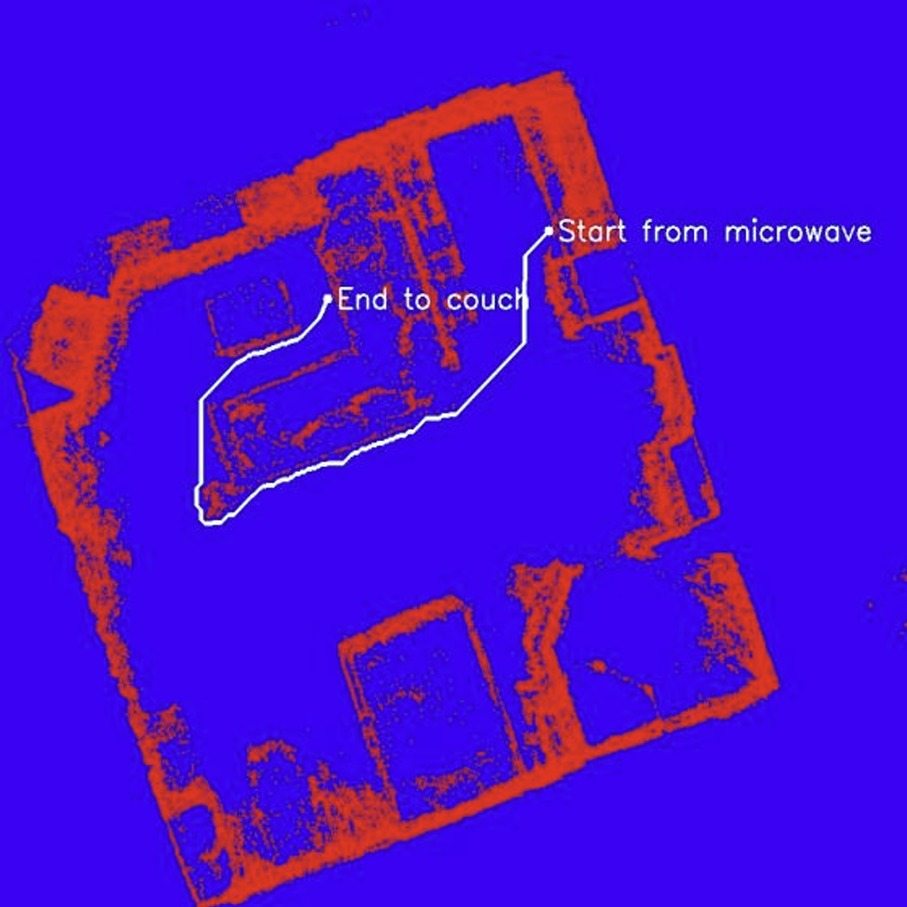

# 3D Scene Reconstruction for Autonomous Robot Navigation

This project aims to develop a comprehensive framework for 3D scene reconstruction, enabling effective autonomous robot navigation in dynamic environments. It integrates advanced object detection, depth mapping, and path planning techniques to enhance robot perception and decision-making capabilities.

  

## Table of Contents
1. [Abstract](#abstract)
2. [Dataset](#dataset)
3. [Objectives](#objectives)
4. [Methodology](#Methodology)

---

## Abstract
This project constructs a detailed 3D representation of environments using video data, enabling robots to classify and localize obstacles accurately. The system integrates depth mapping, object detection, and optimized path planning for safe and efficient navigation in complex settings.

---

## Dataset
We used the **ScanNet sensor dataset**, specifically `scene0000`, containing:
- **5,578 frames** of RGB images
- Depth maps
- Camera pose information

---

## Objectives
The project is structured around the following objectives:
1. **Depth Estimation**: Using MiDAS for accurate depth mapping from RGB images.
2. **3D Scene Reconstruction**: Integrating RGB-D data and camera poses.
3. **Object Detection**: Leveraging YOLOv8 Nano for real-time object detection.
4. **Instance Segmentation**: Using Mobile SAM for segmenting and tracking individual objects.
5. **3D Object Mapping**: Projecting objects into the 3D scene for spatial context.
6. **Bird’s-Eye View Generation**: Simplifying 3D data into a 2D representation.
7. **Optimal Path Planning**: Computing obstacle-free paths in the 3D environment.

  

---

## Methodology

### 1. Depth Estimation
- **Model Used**: MiDAS
- **Outcome**: Predicted depth maps compared against true depth values, demonstrating the accuracy of the approach.

### 2. 3D Scene Reconstruction
- Used true depth images for higher accuracy.
- Integrated RGB-D data and camera poses into a point cloud and mesh representation.

  

### 3. Object Detection
- **Model Used**: YOLOv8 Nano
- **Classes Detected**: Common objects like chairs, tables, sofas, etc.
- **Techniques**: Confidence thresholding and Non-Maximum Suppression.

### 4. Instance Segmentation
- **Model Used**: Mobile SAM
- Generated binary masks aligned with object shapes for use in 3D mapping.

  

### 5. 3D Object Mapping
- Projected segmented objects into the 3D scene with unique visual indicators.

<table>
  <tr>
    <td></td>
    <td></td>
  </tr>
</table>

### 6. Bird’s-Eye View Generation
- Created 2D occupancy grids from 3D point clouds for simplified spatial visualization.

  

### 7. Optimal Path Planning
- **In Progress**: Pathfinding algorithm to compute the optimal path between points of interest.

<table>
  <tr>
    <td></td>
    <td></td>
  </tr>
</table>